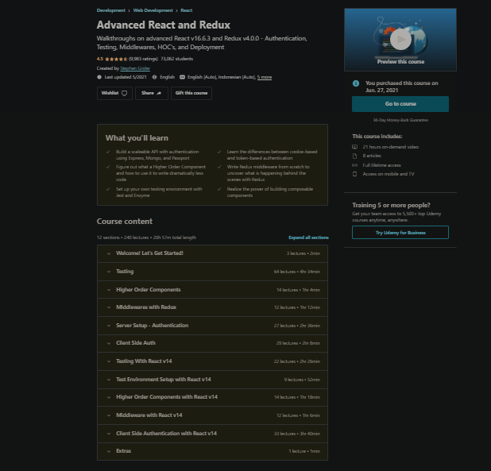

<div align="center">
<!--    -->
</div>


<h4 align="center" >
  Advanced React & Redux
</h4>

<div align = "center">

  
</div>


##
Areas:  {

```
Testing
Higher Order Components
MiddleWare With Redux
Authentication
Snippets
And much More
```
#


##
```
Author:  { Stephen Grider }
```


